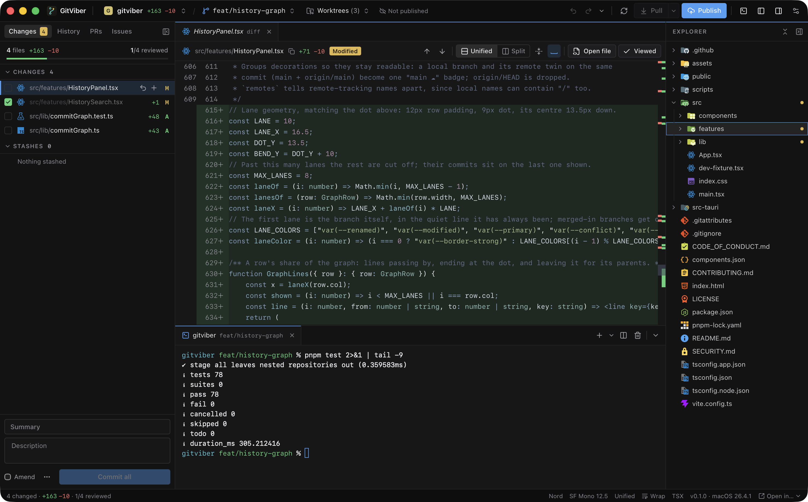
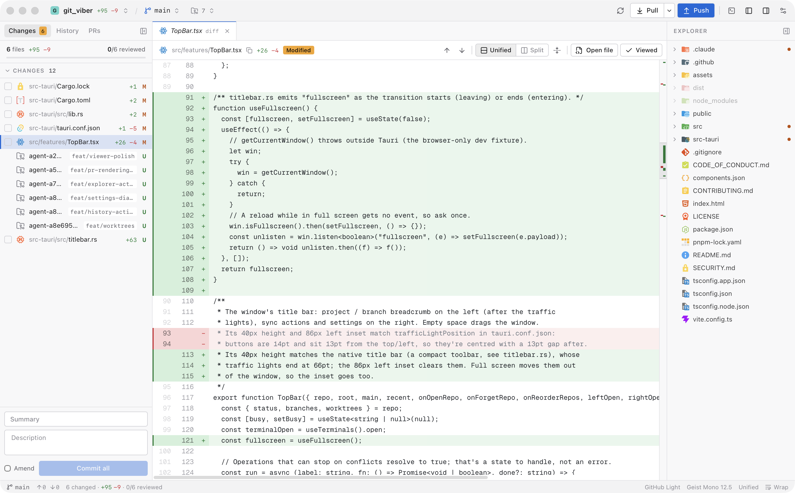
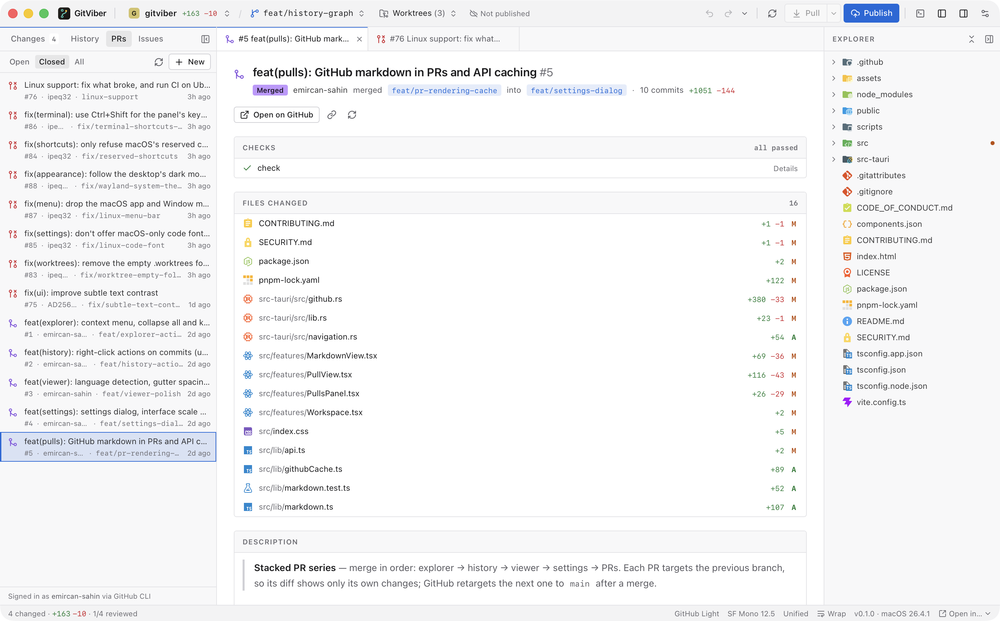

<p align="center">
  
</p>

<h1 align="center">GitViber</h1>

<p align="center">
  A desktop git client for reviewing what your coding agents wrote.
</p>

<p align="center">
  <a href="https://github.com/emircan-sahin/gitviber/actions/workflows/ci.yml"></a>
  
  <a href="LICENSE"></a>
</p>



I run a few agents at once, each in its own worktree, and spend most of the day reading their
diffs. Editors show hunks, GitHub shows them after the push, and most git clients weren't built
for a repo that changes while you look at it. GitViber is the tool I wanted for that: full files,
live updates, every worktree one click away, and a terminal right under the diff.

It's plain git underneath. Every action runs the `git` CLI with your own config, hooks,
credentials and signing, and GitViber writes nothing of its own into the repo.

## Features

| | |
| --- | --- |
| **Diffs** | Whole files, unified or split, with word-level highlights and collapsible unchanged regions |
| **Review** | `J` / `K` through changed files, `V` to mark one viewed. The mark clears when the agent touches the file again |
| **Live** | Status, diffs and the file tree refresh as files change, without losing your scroll position |
| **Worktrees** | Switch worktrees from the top bar, see each one's change count, check a branch out into a new worktree in one step, remove the ones you're done with |
| **Terminal** | Your login shell under the diff (`⌘J`), with tabs and splits. Each worktree keeps its own terminals |
| **Branches** | Merge, rebase, and pull with fast-forward, merge or rebase |
| **Conflicts** | Resolve block by block (current, incoming, both, or edit by hand), then continue, skip or abort |
| **Pull requests** | List, read (with GitHub markdown), review in the same viewer, create, merge, check out. GitHub only for now |
| **Issues** | List, read, open, edit, comment on, close (completed or not planned), reopen and delete (admins). GitHub only |
| **History** | Right-click a commit to undo, revert, reset, check out or tag it. Anything that rewrites pushed commits asks first |
| **Explorer** | Browse any file with change bars in the gutter. Rename, delete to Trash, create and reveal from the right-click menu |
| **Settings** | Light and dark themes, eight syntax themes, interface scale, fonts, and every shortcut rebindable (`⌘,`) |

The project's own worktrees stay out of Changes, even when they live inside it. Other repos nested
inside the project show up there but are kept out of staging, so a stray `git add` can't turn them
into gitlinks.

<table>
  <tr>
    <td></td>
    <td></td>
  </tr>
</table>

## Build

There are no release builds yet. You need Rust (stable), Node 22+, pnpm and git.

```sh
pnpm install
pnpm tauri dev      # run the app (takes the next free port if 1420 is in use)
pnpm tauri dev --port 1421   # or pick one
pnpm tauri build    # release bundle
pnpm check          # what CI runs: build, tests, rustfmt, clippy
```

GitViber is built and tested on macOS. The code compiles elsewhere, but nobody has used it there yet.

## Shortcuts

Every shortcut in the list below except the terminal ones can be rebound in Settings (`⌘,`).
While you type, only shortcuts with `⌘`, `⌃` or an F-key apply, except `⌘←` `⌘→` and `⌃` with a letter, which edit the text.
On Linux and Windows `⌘` is Ctrl, the views are on Alt+1–4, and Ctrl+Tab / Ctrl+Shift+Tab switch tabs.

| Keys | |
| --- | --- |
| `⌘,` | Settings |
| `⌃1` `⌃2` `⌃3` `⌃4` | Changes, History, PRs, Issues |
| `⌘1` … `⌘8`, `⌘9` | Go to tab 1 to 8, the last tab |
| `⇧⌘]` `⇧⌘[`, `⌘→` `⌘←`, `⌃⇥` `⌃⇧⇥` | Next / previous tab |
| `J` `K` | Next / previous changed file |
| `↓` `↑` `↵` | Move through the focused list (Changes, History, PRs, Issues), `↵` keeps the tab open; `Home` `End` `PgUp` `PgDn` too |
| `⇧F10` | The focused row's right-click menu |
| `V` | Mark file viewed |
| `S` `⌘⌫` | Stage or unstage, discard the open file |
| `F7` `⇧F7`, `⌥↓` `⌥↑` | Next / previous change |
| `⌥S` `⌥C` `⌥Z` | Split view, collapse unchanged, word wrap |
| `⌘B` `⌥⌘B` | Toggle the git panel, the file explorer |
| `⇧⌘G` `⌘E` `⇧⌘E` | Focus the git panel, the code view, the file explorer |
| `F6` `⇧F6` | Focus the next / previous panel (not from the terminal, which keeps F-keys for its programs) |
| `→` `⎋` | From a file in a list to its code, and back |
| `↑` `↓` `PgUp` `PgDn` `Space` `Home` `End` | Scroll the focused code view, `←` `→` sideways |
| `⌘J` or `⌃` `` ` `` | Toggle the terminal |
| `⌘T` `⌘D` `⌘K` | New terminal, split, clear (in the terminal) |
| `⌘=` `⌘−` `⌘0` | Zoom the interface |
| `⌥⌘=` `⌥⌘−` `⌥⌘0` | Code font size |
| `⌘W` | Close tab, or the terminal pane in focus |
| `⌘↵` | Commit (in the commit message) |
| `⌘R` | Refresh |
| `⌘O` | Open repository |

## GitHub sign-in

GitViber never asks for a token. For pull requests and issues it borrows a login you already have: the GitHub
CLI (`gh auth token`) first, then git's stored github.com credential (Keychain, GitHub Desktop, Git
Credential Manager). The token stays in memory.

## Privacy

No API keys, no telemetry. The app talks to your git remotes and, for pull requests and issues, GitHub.
It only reads files inside the repository you open. Markdown from GitHub is cut down to
GitHub's own HTML allowlist (no scripts, styles or forms), and an image hosted outside GitHub
loads only when you click it.

## Stack

Tauri 2 and Rust on the backend, React 19 with Radix and Tailwind v4 on the front. Diffs are
computed in Rust with `similar`, highlighting is Shiki in a web worker, and the UI runs in the
system webview, so there's no bundled Chromium.

## Contributing

Bug reports and small, focused PRs are welcome. [CONTRIBUTING.md](CONTRIBUTING.md) covers setup and
the few rules the app depends on. Report security issues privately, see [SECURITY.md](SECURITY.md).

## License

[MIT](LICENSE)
