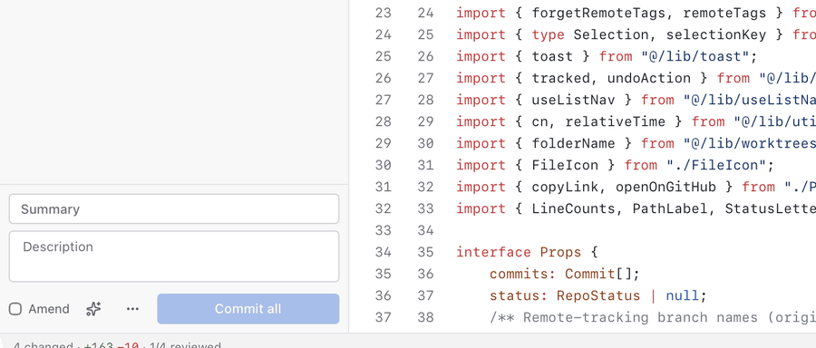

<p align="center">
  
</p>

<h1 align="center">GitViber</h1>

<p align="center">
  <b>Vibe code from one app.</b><br>
  Run your agents in parallel worktrees, watch their diffs land live, browse the code, test it in
  the terminal and commit, without GitHub Desktop, an editor and three terminal windows open.
</p>

<p align="center">
  <a href="https://github.com/emircan-sahin/gitviber/releases/latest"></a>
  <a href="https://github.com/emircan-sahin/gitviber/actions/workflows/ci.yml"></a>
  
  <a href="LICENSE"></a>
</p>


<p align="center">
  <a href="https://github.com/emircan-sahin/gitviber/releases/latest"><b>Download for macOS or Linux</b></a>
  ·
  <a href="#install">Install</a>
  ·
  <a href="CHANGELOG.md">What's new</a>
</p>

## Why GitViber

Coding with agents turned the day into reading code. You start Claude Code or Codex in a few
worktrees, then juggle an editor to look at the files, GitHub Desktop to see the diffs, a pile of
terminals to run things and a browser for the pull requests. Editors like Cursor easily eat
gigabytes of RAM just to let you read.

GitViber is one window for all of it, and it's small:

- **14 MB app.** GitHub Desktop is 681 MB. No bundled Chromium, a Rust core and the system webview.
- **Idles at 0% CPU.** It wakes up when files change, not on a timer.
- **Memory it gives back.** Activity Monitor also counts memory the app is done with but WebKit
  hasn't collected yet, so the number climbs while you click around and drops again after a few
  idle minutes. Closing a terminal frees its GPU memory at once.
- **Fast on big diffs.** Diffs are computed in Rust and highlighted off the main thread.
- **Plain git underneath.** Your config, hooks, credentials and signing. Nothing of its own goes into the repo.

## Everything in one window

### Many agents, one screen

Give every agent its own worktree and switch between them from the top bar, each with its change
count. Start one from any branch or commit, in the folder you choose, or check a pull request out
into its own worktree without touching yours. Rename one along with its folder, lock it, and
remove or prune it when the work is merged. Every worktree keeps its own terminals, so nothing
gets lost when you hop between them.

### Watch the work land

Diffs refresh the moment an agent saves, without losing your scroll position. Whole files, unified
or split, word-level highlights. `J` / `K` walk the changed files and `V` marks one viewed; when
the agent touches it again, the mark clears so you know to look again.

### Test it right there

A real terminal sits under the diff (`⌘J`), with tabs and splits. Run the tests, start the dev
server or talk to the agent without leaving the change you're reading.

### Browse the code, not just the diff

A full file explorer with change bars in the gutter, quick open (`⌘P`) and rename, create and
delete from the right-click menu. For most days that's the editor you no longer need open.

### Commit messages from your agent

Turn it on in Settings, hit the sparkle next to the commit box, and your own `claude -p` or
`codex exec` writes the message from the diff. No API key, no extra account: it uses the CLI
you're already signed in to.



### Good-looking, and yours

Light and dark themes, eight syntax themes, your own code font and interface scale. Every action
has a shortcut, every shortcut can be rebound, and holding `⌘` shows them all.

<table>
  <tr>
    <td></td>
    <td></td>
  </tr>
</table>

### And the rest of git

| | |
| --- | --- |
| **History** | Branches and merges as a colored lane graph. Undo, revert, reset, check out or tag from the right-click menu; anything that rewrites pushed commits asks first |
| **Branches** | Merge, rebase, and pull with fast-forward, merge or rebase |
| **Conflicts** | Resolve block by block (current, incoming, both, or by hand), then continue, skip or abort |
| **Pull requests** | List, read, review in the same diff viewer, create, merge and check out (GitHub) |
| **Issues** | List, read, open, edit, comment, close and reopen (GitHub) |

## Install

Grab the latest build from [Releases](https://github.com/emircan-sahin/gitviber/releases/latest):

| | |
| --- | --- |
| **macOS** 13 or later | `GitViber_<version>_universal.dmg`, one app for Apple Silicon and Intel, signed and notarized |
| **Linux** x86_64 | `.deb` for Debian and Ubuntu, `.rpm` for Fedora, `.AppImage` for the rest |

Or with Homebrew:

```sh
brew install --cask emircan-sahin/tap/gitviber
```

On Linux:

```sh
sudo apt install ./GitViber_*_amd64.deb          # Debian, Ubuntu
sudo dnf install ./GitViber-*.x86_64.rpm         # Fedora
chmod +x GitViber_*.AppImage && ./GitViber_*.AppImage
```

GitViber tells you when a new version is out. The macOS app and the AppImage update in place;
a `.deb` or `.rpm` install gets a link to the release to download it from. What changed is in the [changelog](CHANGELOG.md), and every release lists SHA-256
checksums in `SHA256SUMS`.

GitViber is used daily on macOS. The Linux builds are tested in CI, but the app itself is only
starting to get used there ([#35](https://github.com/emircan-sahin/gitviber/issues/35)). Windows
is untested and has no build yet.

### Requirements

- **git 2.36 or newer.** GitViber runs your own git, and says so on first launch if it's missing
  or older. On macOS, `xcode-select --install` or Homebrew's `git` will do.
- **Optional:** the [GitHub CLI](https://cli.github.com) (`gh auth login`) for pull requests and
  issues; git's stored github.com credential works too. `claude` or `codex` if you want commit
  messages written for you.

### Build from source

You need Rust (stable), Node 22+, pnpm and git.

```sh
git clone https://github.com/emircan-sahin/gitviber && cd gitviber
pnpm install
pnpm install:mac    # macOS: builds a release and copies it into /Applications
pnpm tauri build    # Linux: makes a .deb, an .rpm and an AppImage
```

On Linux, Tauri's webview also needs WebKitGTK 4.1 and a C toolchain:

```sh
sudo apt install libwebkit2gtk-4.1-dev build-essential        # Debian, Ubuntu
sudo dnf install webkit2gtk4.1-devel gcc                       # Fedora
sudo pacman -S --needed webkit2gtk-4.1 base-devel              # Arch
```

If the AppImage step fails in `linuxdeploy` (its bundled `strip` is too old for current
toolchains, e.g. on Arch), run it with `NO_STRIP=true`.

## Privacy

No telemetry, no API keys. The app talks to your git remotes and, for pull requests and issues,
GitHub. For those it borrows a login you already have, the GitHub CLI (`gh auth token`) first,
then git's stored github.com credential, and keeps the token in memory. GitViber checks GitHub
Releases for updates at launch and every few hours; turn it off in Settings → Updates. Errors, including every
error message the app shows you (a failed push's git output, say), go to a local file
(`~/Library/Logs/app.gitviber.desktop/errors.log` on macOS, Help → Show Logs) and nowhere else,
with logins in URLs and GitHub tokens blanked out. Help → Copy Diagnostics copies only the versions
of GitViber, the OS, git, `gh` and WebKit, for you to paste into a bug report. Markdown from GitHub
is cut down to GitHub's own HTML allowlist, and an image hosted outside GitHub loads only when you
click it. Commit message suggestions go wherever the command you picked sends them.

## FAQ

**Will macOS say it "can't be opened" or "is damaged"?** Not for a release: the app is signed
with a Developer ID and notarized by Apple. If it does, the download didn't come from
[Releases](https://github.com/emircan-sahin/gitviber/releases) or was changed on the way; check
it against `SHA256SUMS` and download it again. A build of your own isn't notarized, but it's
already trusted on the Mac that built it.

**How do I sign in to GitHub?** There's no sign-in of its own. Run `gh auth login` once, or have
git remember a github.com login (any HTTPS push does), and GitViber borrows it. See
[Privacy](#privacy).

**Where are the logs?** Help → Show Logs. They're at `~/Library/Logs/app.gitviber.desktop/` on
macOS and `~/.local/share/app.gitviber.desktop/logs/` on Linux. Help → Copy Diagnostics copies
the versions a bug report needs.

**Where are my settings?** In the app's own storage, never in your repositories:
`~/Library/WebKit/app.gitviber.desktop` on macOS, `~/.local/share/app.gitviber.desktop` on Linux.

**How do I uninstall it?** On macOS, drag GitViber to the Trash (or
`brew uninstall --cask --zap gitviber`, which also removes its settings, caches and logs). On
Linux, `sudo apt remove git-viber` or `sudo dnf remove git-viber`, or delete the AppImage. To
remove the settings by hand, delete the folders above and `~/Library/Caches/app.gitviber.desktop`.

## Shortcuts

<details>
<summary>Every shortcut, and how they map on Linux</summary>

<br>

Every shortcut below except moving around a list or view (arrows, `↵`, `⎋`, `⇧F10`) can be rebound in Settings (`⌘,`).
While you type, only shortcuts with `⌘`, `⌃` or an F-key apply, except `⌘←` `⌘→` and `⌃` with a letter, which edit the text.
On Linux and Windows `⌘` is Ctrl, the views are on Alt+1–4, Ctrl+Tab / Ctrl+Shift+Tab switch tabs, and the terminal's
`⌘T` `⌘D` `⌘K` `⌘W` are Ctrl+Shift+T, D, K and W, since Ctrl+letter stays the shell's.

| Keys | |
| --- | --- |
| `⌘,` | Settings |
| Hold `⌘`, or `⌘/` | Show every shortcut, the ones that don't work where you are dimmed (the hold can be turned off in Settings) |
| `⇧⌘P` `⌘P` | Command palette, quick open |
| `⌃1` `⌃2` `⌃3` `⌃4` | Changes, History, PRs, Issues |
| `⌘1` … `⌘8`, `⌘9` | Go to tab 1 to 8, the last tab |
| `⇧⌘]` `⇧⌘[`, `⌘→` `⌘←`, `⌃⇥` `⌃⇧⇥` | Next / previous tab |
| `J` `K` | Next / previous changed file |
| `↓` `↑` `↵` | Move through the focused list (Changes, History, PRs, Issues), `↵` keeps the tab open; `Home` `End` `PgUp` `PgDn` too |
| `⇧F10` | The focused row's right-click menu |
| `V` | Mark file viewed |
| `S` `⌘⌫` | Stage or unstage, discard the open file |
| `F7` `⇧F7`, `⌥↓` `⌥↑` | Next / previous change |
| `⌥⌘S` `⌥⌘N` `⇧⌘⌫` | Stage, unstage, discard the selected lines, else the change at the cursor (next / previous change puts it there) |
| `⌥S` `⌥C` `⌥Z` | Split view, collapse unchanged, word wrap |
| `⌘B` `⌥⌘B` | Toggle the git panel, the file explorer |
| `⇧⌘G` `⌘E` `⇧⌘E` | Focus the git panel, the code view, the file explorer |
| `F6` `⇧F6` | Focus the next / previous panel (not from the terminal, which keeps F-keys for its programs) |
| `→` `⎋` | From a file in a list to its code, and back |
| `↑` `↓` `PgUp` `PgDn` `Space` `Home` `End` | Scroll the focused code view, `←` `→` sideways |
| `⌘J` or `⌃` `` ` `` | Toggle the terminal |
| `⌘T` | New terminal |
| `⌘D` `⌘K`, `⌥⌘←` `⌥⌘→` | Split, clear, previous / next pane (in the terminal) |
| `⌘=` `⌘−` `⌘0` | Zoom the interface |
| `⌥⌘=` `⌥⌘−` `⌥⌘0` | Code font size |
| `⌘W` | Close tab, or the terminal pane in focus |
| `⌘↵` | Commit (in the commit message) |
| `⌘R` | Refresh |
| `⌘O` | Open repository |

</details>

## Hacking on it

Tauri 2 and Rust on the backend, React 19 with Radix and Tailwind v4 on the front. Diffs are
computed in Rust with `similar`, highlighting is Shiki in a web worker, and the UI runs in the
system webview, so there's no bundled Chromium.

```sh
pnpm tauri dev      # run the app (takes the next free port if 1420 is in use)
pnpm check          # what CI runs: build, tests, rustfmt, clippy
```

Bug reports and small, focused PRs are welcome. [CONTRIBUTING.md](CONTRIBUTING.md) covers setup
and the few rules the app depends on. Report security issues privately, see [SECURITY.md](SECURITY.md).

## License

[GPL-3.0](LICENSE). Use it, change it, share it; a fork you ship has to stay open under the same
license.
